# 📌 [코드잇 스프린트_AI_4기] 초급 팀프로젝트: 경구약제 이미지 객체 인식 모델
---
코드잇 스프린트 초급 팀프로젝트이다. 이번 프로젝트의 목표는 사진 속에 있는 최대 4개의 알약의 이름(클래스)과 위치(바운딩 박스)를 검출하는 것이다. 또한 하이퍼파라미터 튜닝 등을 통해 최고 성능의 모델을 개발하는 것이 목표이다.
팀은 5인 1팀으로 Project Manager / Data Engineer / Model Architect + Experimentation Lead 로 구성되어있다.
**모델 점수와 상관없이 실무의 팀 개발을 체험하는 과정으로 좋은 인맥 형성, 소프트 스킬 향상, 최선의 팀 결과물 완성이 코드잇에서 말하는 목표이다.**

## 프로젝트 기간: 25.09.09 15:00 ~ 25.09.25 23:50

## kaggle 및 데이터셋 링크
[프로젝트 자료 링크](https://www.kaggle.com/competitions/ai04-level1-project/data)

## 개인 역할

|역할|담당자|업무|
|----|-----|-----|
|Project Manager|신승목|프로젝트 일정관리, 진행상태 확인 및 종합. 최종 보고서 작성, 개발 지원(YOLOv8모델 및 성능 개선 실험, EDA)|
|Data Enginner|지동진|데이터 파이프라인 구축, 데이터 EDA 시행, 파이프라인 자동화, github 및 협업환경 구성 및 관리(RT-DETR모델링, 성능개선 시험)|
|Model Architect|이재영|YOLOv11 모델 담당(모델링, 성능 개선 실험진행)|
|Model Architect + Experimentation Sub|남경민|필요시 지원|
|Experimentation Lead|이솔형|YOLOv8 모델 성능 개선 실험 진행|

## 팀프로젝트 수칙
### 1. 데이터 사용 규칙
- 제공된 데이터셋 외 외부 데이터 사용 가능
### 2. 모델 및 코드 제출
- 제출 파일 형식을 준수해 주세요.
- 모델 및 결과물의 재현 가능성을 확보해 주세요.
### 3. 평가 기준 및 리더보드 운영
- 평가 지표: mAP(mean Average Precision)
- 1일 최대 제출 횟수: 5회
- 리더보드는 Public / Private Score로 운영합니다 (최종 순위: Private Score 기준)

## 📂 폴더 구성
```
Codeit_AI_4th_Drug_image_CV_project/
├── data/                        # 실제 데이터는 GitHub에 포함되지 않으며,
│   └── data.txt                 # Google Drive 내 데이터 공유 링크가 담긴 텍스트 파일만 존재
├──data_pipeline/                # 데이터 전처리 파이프라인__(자동화)__
│   └── notebooks/               # 전처리 모듈
│   │   ├── data_preprocesss_for_YOLO.ipynb # 공통 전처리 코드
│   │   ├── New_split_dataset.ipynb         # 소규모 데이터셋 생성기
│   │   ├── unzip_dataset.ipynb             # 코랩 전용 압축해제 코드
│   │   └── unzip_external_data.ipynb       # 추가 데이터 압축해제 및 기존 데이터와 병합
├── notebooks/                   # Jupyter 노트북(EDA 관련 파일 업로드)
│   └── data_EDA.ipynb           # 데이터 EDA 보고서
├── model/                       # 모델 관련 코드
│   ├── notebooks/               # Jupyter 인

## 모델 구조

```mermaid
graph LR
    subgraph " "
        A["🖼️<br/><b>Raw Images</b><br/>train + test"]
        A1["📋<br/><b>COCO Annotations</b><br/>JSON files"]
    end
    
    subgraph " "
        B["📊<br/><b>Data Processing</b><br/>RTDETRDataProcessor"]
        B1["🔄<br/><b>Format Conversion</b><br/>COCO → YOLO"]
        B2["📄<br/><b>Mapping Files</b><br/>dl_idx ↔ class"]
    end
    
    subgraph " "
        C["🤖<br/><b>RT-DETR Training</b><br/>rtdetr-l.pt"]
        C1["💾<br/><b>Best Model</b><br/>best.pt"]
    end
    
    subgraph " "
        D["⚡<br/><b>Inference</b><br/>RTDETRInference"]
        D1["🎯<br/><b>Detection</b><br/>bbox + class"]
        E["📊<br/><b>CSV Submission</b><br/>competition format"]
    end
    
    A --> B
    A1 --> B
    B --> B1
    B --> B2
    B1 --> C
    B2 --> C
    C --> C1
    C1 --> D
    B2 --> D
    D --> D1
    D1 --> E
    
    %% 스타일링 - 3:2 가로 비율 최적화
    classDef inputStyle fill:#E3F2FD,stroke:#1976D2,stroke-width:4px,color:#000,font-size:16px,font-weight:bold
    classDef processStyle fill:#F3E5F5,stroke:#7B1FA2,stroke-width:4px,color:#000,font-size:16px,font-weight:bold
    classDef trainStyle fill:#FFF3E0,stroke:#F57C00,stroke-width:4px,color:#000,font-size:16px,font-weight:bold
    classDef inferStyle fill:#E8F5E8,stroke:#388E3C,stroke-width:4px,color:#000,font-size:16px,font-weight:bold
    classDef outputStyle fill:#FFEBEE,stroke:#D32F2F,stroke-width:4px,color:#000,font-size:16px,font-weight:bold
    classDef mappingStyle fill:#FFFDE7,stroke:#FBC02D,stroke-width:4px,color:#000,font-size:16px,font-weight:bold
    
    %% 클래스 적용
    class A,A1 inputStyle
    class B,B1 processStyle
    class B2 mappingStyle
    class C,C1 trainStyle
    class D,D1,E inferStyle
```


## 예측 결과 예시
---
## 개인 협업 일지
- [신승목](https://www.notion.so/1-26919fbbffa18051baa4c561e60e4359?source=copy_link)
- [이솔형](https://www.notion.so/26924d5698b6806e9110e224f6c44d26?source=copy_link)
- [이재영](https://www.notion.so/e157ae4259404390b46f1c4f40dc7c2f?v=43c93ab01977486b9301ca551c2a49fc&source=copy_link)
- [지동진](https://www.notion.so/1-2782fbf75fd3801d8008c6015d1363a5?source=copy_link)
- [남경민](https://www.notion.so/26b492a41e1380698408ce2e98850420?source=copy_link)
